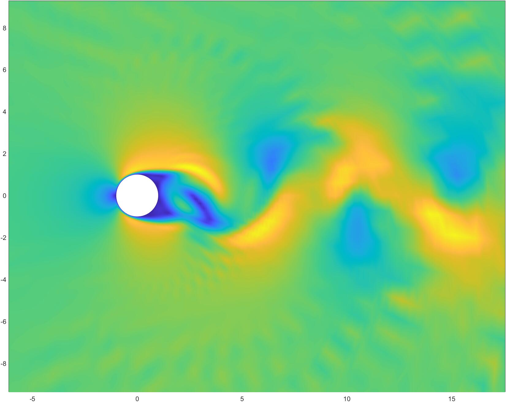

# 圆柱绕流模拟

## 依赖

需要使用：

- Eigen库：[libeigen / eigen · GitLab](https://gitlab.com/libeigen/eigen)。
- SYCL库、icpx编译器：[Intel® oneAPI Base Toolkit: Essential oneAPI Tools & Libraries](https://www.intel.cn/content/www/cn/zh/developer/tools/oneapi/base-toolkit.html)。

需使用类似 `gen_gird.cpp` 的方法生成网格到 `X.txt` 与 `Y.txt`。

## 编译运行

```sh
icpx -fsycl src/main.cpp
./a.out
```

若出现下面问题（e.g. on Intel DevCloud）：

```
error: Double type is not supported on this problem.
in kernel: 'xxxxxx'
error: backend compiler failed build.
```

需在bash内输入：

```bash
export OverrideDefaultFP64Settings=1 
export IGC_EnableDPEmulation=1
```

## 参数

```c++
const int DIV = 1000; // 每秒划分的份数
const int SEC = 200; // 模拟总时间（单位：秒）

const double Re = 200; // 流体雷诺数
const double err = 0.005; // psi迭代要求的最小误差
```

## 输出

输出到同目录下 `./output/` 文件夹中，包含 `PSI`、`U`、`V` 三种数据，后面数字代表模拟的秒数。

随后可使用 `matlab` 或 `python` 进行数据分析。

下面是 `Re = 200, T = 100s` 时的速度云图：

